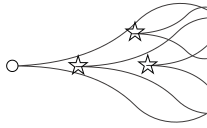

# CanEvolve 

#### Overview

This package is used to generate realistic variant allele frequency (VAF) distributions that are observed in bulk-sequenced single tumour biopsies. We use completely stochastic simulations to generate tumour poulations with subclones/driver haplotypes under positive selection. In addition, to avoid spurious subclones from genetic drift in computationally feasible population sizes, we use a fully synthetic generative process to create neutral VAF distributions based on sampling from a Pareto distribution. We also integrate feature engineering functions to convert the VAF distribution into deep learning friendly data structures for evolutionary inference. For deep learning applications using this synthetic data, please see *ADD GITHUB REPO HERE*

#### Acknowledgements

This package is an extension of the [CancerSeqSim.jl](https://github.com/marcjwilliams1/CancerSeqSim.jl) framework developed by Marc Williams. In addition, we generate neutral synthetic data using a Pareto distribution with shape and scale parameters retrieved from PCAWG fits by [Caravagna et al., 2020](https://www.nature.com/articles/s41588-020-0675-5).
