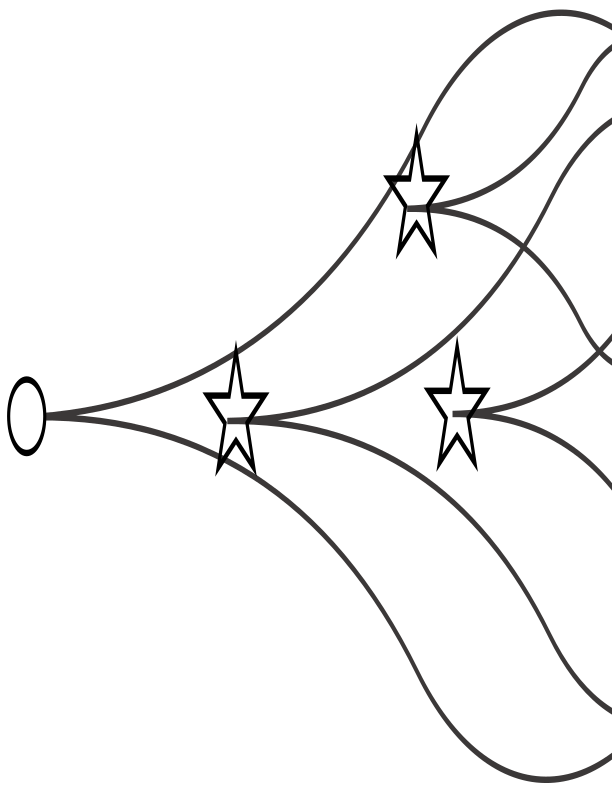
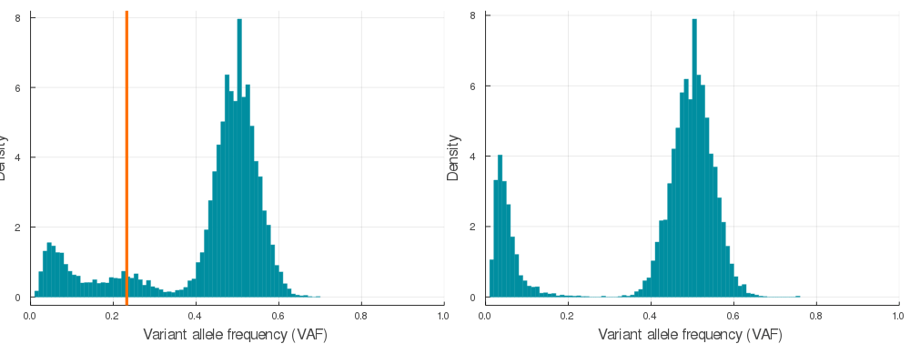

# CanEvolve 

[](https://travis-ci.com/tomouellette/CanEvolve.jl)

### Overview

This julia package is used to generate realistic variant allele frequency (VAF) distributions that are observed in bulk-sequenced single tumour biopsies. We use completely stochastic simulations to generate tumour poulations with subclones/driver haplotypes under positive selection. In addition, to avoid spurious subclones that arise due to genetic drift in computationally feasible, but small, population sizes, we use a fully synthetic generative process to create neutral VAF distributions based on sampling from a Pareto distribution. We also integrate feature engineering functions to convert the VAF distribution into deep learning friendly data structures for evolutionary inference. For deep learning applications using this synthetic data, please see [TumE](https://github.com/tomouellette/TumE)

<hr>

### Installation

```julia
using Pkg
Pkg.add("CanEvolve")
```

### Generating VAF distributions from synthetic tumours

We provide a fast synthetic data generator that randomly samples empirically realistic simulation parameters from pre-specified distributions (see *sampleParameters* function in */src/automation*). The *autoSimulation*  function will generate synthetic data of a tumour under positive selection with a corresponding parameter matched neutral synthetic tumour. The example below simulates tumours at a birth rate = 1 and death rate = 0.1, and ensures the tumour subject to positive selection has at least 1 or 2 subclones between 10 - 40% VAF (20 - 80% cellular fraction).

```julia
p, n = autoSimulation(1, 0.1, nsubclone_min = 1, nsubclone_max = 2, lower_cutoff = 0.1, upper_cutoff = 0.4)
```

To visualize the VAF distribution for the positively selected (*p*) and neutrally evolving (*n*) tumours, run *plotVAF*. 

```julia
using Plots
plot(plotVAF(p, bins = 100), plotVAF(n, bins = 100), layout = 2)
```


A sample of 20 auto simulations. The vertical orange lines identify the subclone VAF in the *p* VAF distribution (left).

### Feature engineering for deep learning

If you would like to convert synthetic VAF distributions into a usable input for inference, just run *engineer*.

```julia
# Segment the VAF distribution into 64 and 128 bins that are normalized by maximum value
features, labels = engineer(p, k = [64, 128])

# Segment the VAF distribution into 64 and 128 bins of non-normalized mutation counts
features, labels = engineer_un(p, k = [64, 128])
```

<hr>

#### Acknowledgements

This package makes use of the rKMC simulation algorithm from the [CancerSeqSim.jl](https://github.com/marcjwilliams1/CancerSeqSim.jl) framework developed by Marc Williams. In addition, we generate neutral synthetic data using a Pareto distribution with shape and scale parameters retrieved from PCAWG fits by [Caravagna et al., 2020](https://www.nature.com/articles/s41588-020-0675-5).
